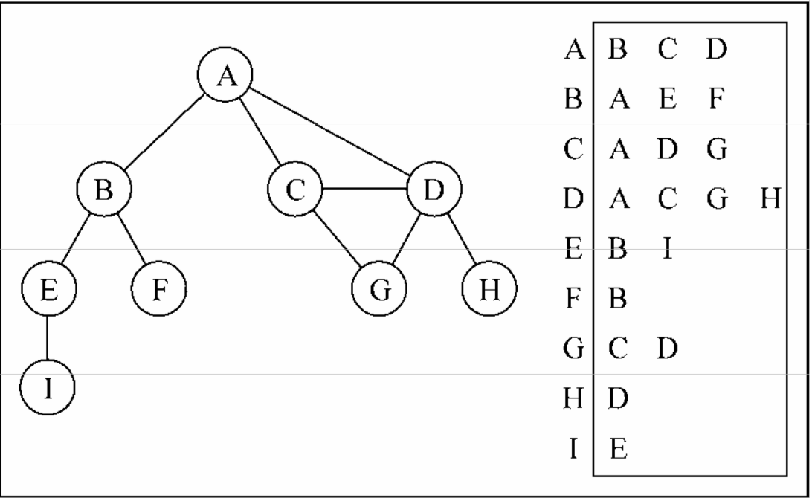

# 图
G = (V, E);
图也有几个性质
- 度：一个顶点跟几个顶点相邻就有多少度。
- 路径：是顶点 v1, v2 ... vk 的一个连续序列，其中 vi + vi+1 是相邻的。
- 图分有向图和无向图
    - 有向图中如果两个顶点互指，则两个顶点之间是 **强连通**的
    
    C 和 D 是强连通的

## 图的表示方法
1、用邻接矩阵，但使用邻接矩阵还有有多余的内存去记录顶点不相连的情况，占用内存。
  
2、用邻接表，由图中每个顶点的相邻顶点列表所组成。
  

## 图的创建
1. 图构造函数中有两个私有属性，一个是 vertices 数组，用于存放顶点，还有一个 adjList字典，键是顶点，值为一个数组，用于存放与顶点相邻的顶点。
2. 两个方法，一个 ```addVertices```，如果图中没有该顶点，就放入 adjList 中，赋空数组。一个是 ```addEdge```，用来表示两个点的连接关系。
``` 
function addEdge(v, w) {
    adjList.get(v).push(w);
    adjList.get(w).push(v);
}
```

## 广度遍历
从第一个顶点开始，先遍历第一个顶点，再遍历与顶点相邻的顶点，再遍历与相邻顶点相邻的顶点，层层遍历。


### 代码思路
广度遍历的数据结构是队列的形式，先进来的先探索。
1. 先用 ```initalColor()```对所有顶点染成白色。用一个 ```colors```数组记录每个顶点颜色。
    - 白色：该顶点没有被访问；
    - 灰色：顶点被访问过，但没探索过（就是被放入队列了）；
    - 黑色：已经访问且探索过；
2. 用一个队列记录准备被探索的顶点。
3. 把第一个顶点推进队列，染灰色，用 ```adjList.get()```得到它的相邻顶点（字典中键对于的值是与顶点相邻的顶点）
4. 遍历每个相邻顶点，染灰色放进队列（这样下一个被探索的就是相邻顶点）
5. 第一个顶点被染黑色，执行传入的回调。
6. 只要队列中有顶点，就一直重复上面的步骤。

### 深度遍历
深度遍历是一直往下找最深处的顶点，再按原路返回探寻下一条路径。可以看出来这要用到递归。   
发现要用到递归的地方都是原来的函数里套一个函数，里面那个函数才是要递归的，最外面那个函数存储要记录的数据。   


### 代码思路
1. ``` initalColor()```对每个顶点染白色。
2. 第一个顶点开始，调用```bfsVisit()```先探索第一个顶点。
3. 获取第一个顶点的相邻顶点，如果该顶点颜色是白色，对该顶点调用```bfsVisit()```，所以调用是一层层下去的，到底了后回到最初开始递归的地方，判断与第一个顶点相邻的第二个顶点是否为白色，是就继续递归第二个相邻顶点。