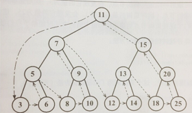

# 树
## 树的常用概念
树的层次：有几层就有几个层次。
节点深度：有多少祖辈就有多少深度，比如往上有父亲、爷爷、祖父，则节点深度是3。  
树的高度：所有节点深度的最大值。  
节点的度：节点的度就是节点有几条往下延伸的线（有几个儿子）。  
满二叉树：完美的三角形那种树。
完全二叉树：按满二叉树的规则一个节点一个节点往下排，但是不能像满二叉树那样圆满。
## 搜索树
最简单的树了。规则是：左节点 < 中节点 <= 右节点

## 树的中序、先序、后序遍历
知道了三种排序是怎么排的后，三种排序的写法其实只是顺序上的不同。
PS：先序遍历是从根节点开始，把左边的根节点全部遍历完，再从最左边的子树的右节点开始往上遍历

